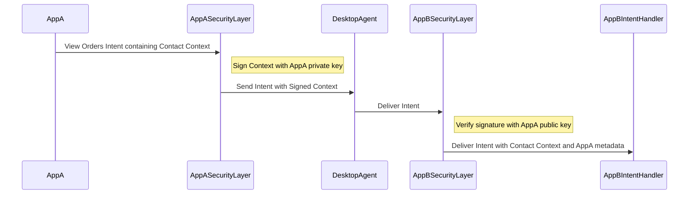
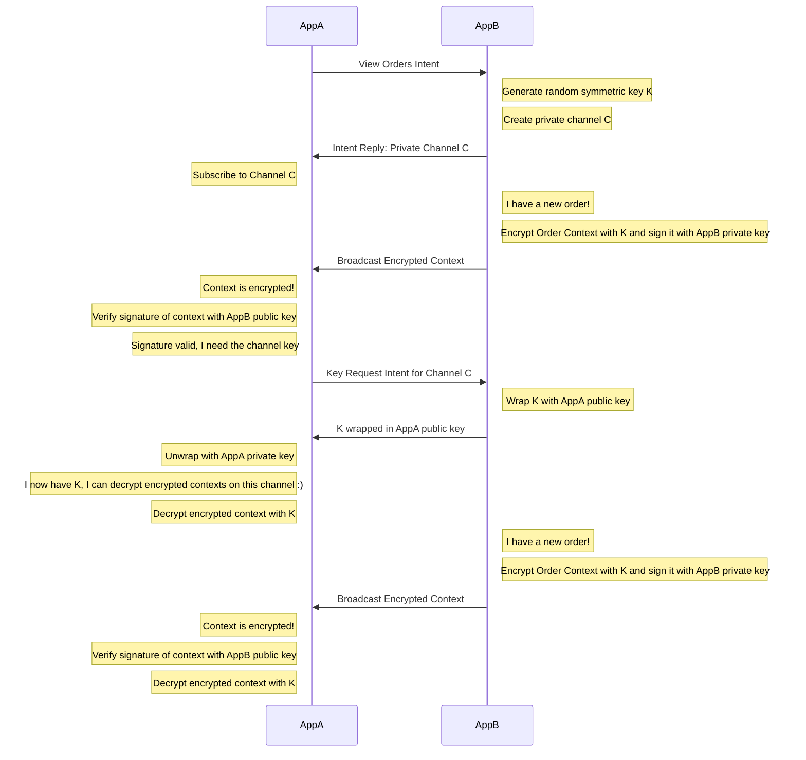

# FDC3 Security

This is a minimal proof-of-concept for FDC3 Security, as proposed by the FDC3 Identity and Security Working Group.

This project currently provides a Javascript implementation of FDC3 Security as a "decorator" for the FDC3 DesktopAgent API, which provides the following functionality:

1.  Signing of FDC3 Messages (e.g. Broadcast), which allows receipients of broadcasts to verify the sender.
2.  Encrypted FDC3 Private Channels, which allows for secure communication between two or more FDC3 apps privately without observation of messages from either other apps or the desktop agent.

## Signing Of FDC3 Messages

When two applications are using the FDC3 Security module, revceivers can check the authenticity of sender's messages by inspecting the `ContextMetadata` object when their `ContextHandler` is called. See: [ContextHandler](https://fdc3.finos.org/docs/api/ref/Types#contexthandler)

FDC3 Security adds the `authenticity` key to the `ContextMetadata` like so:

```
{
  "authenticity":  {
    "verified":true,                  // set to true if the broadcast was signed and  had a signature that could be verified
    "valid":true,                     // set to true if the public key was able to verify the signature
    "publicKeyUrl":"/sp1-public-key"  // the URL of the public key used to verify the signature, as given by the sender
  }
}
```

The process works in the following way:



## Encrypted FDC3 Private Channels

When two applications are using the FDC3 Security module, they can create a private channel between them, which is encrypted with a symmetric key. This allows for secure communication between two or more FDC3 apps privately without observation of messages from either other apps or the desktop agent.

In order to broadcast encrypted messages, the sender (A) creates the private channel and then calls the following function:

```javascript
privateChannel.setChannelEncryption(true)
```

This instructs the FDC3 Security module to create a symmetric key for the channel and use it to encrypt all messages sent on that channel.

When a recipient (B) receives an encrypted message on a private channel, it broadcasts a special FDC3 Context object of type `fdc3.security.symmetricKey.request` on the private channel, signed with its own private key.

A handles this context object by setting up a listener like so:

```javascript
privateChannel.addContextListener(SYMMETRIC_KEY_REQUEST_CONTEXT, async (_context: Context, meta: ContextMetadataWithAuthenticity | undefined) => {
  if (meta?.authenticity?.verified && meta?.authenticity?.valid) {
    // inspect the meta.authenticity.publicKeyUrl to ensure you want to communicate with this sender,
    // before calling:
    if (trustThisParty(meta.authenticity.publicKeyUrl)) {
      pc.broadcastKey(meta.authenticity.publicKeyUrl)
    }
  }
})
```

When A calls `pc.broadcastKey`, it responds by publishing the symmetric key encrypted with the public key of (B), allowing B (and only B) to decrypt the symmetric key and use it to decrypt anything else broadcast on the channel.

This is summarised here:



## Installation

### Build And Test The Code

From the `javascript/fdc3-security` directory, run:

```
npm install
npm run test  # Runs Cucumber tests and coverage
npm build
```

This will build an ES6 module in the `dist` directory.

### Running The Demos

Example javascript code is included in this project in the `/javascript/fdc3-security/demo` directory. This includes a simple example of two FDC3 apps communicating with each other using the FDC3 Security module:

- `sp1`: Listens for the `SecretComms` intent to be raised, returning a Private Channel back to raisers and then broadcasting encrypted messages on that channel.
- `sp2`: Raises the `SecretComms` intent, listens to the private channel and outputs messages in the browser window that it receives.

In order to try this out:

1.  Start the demo applications by running

```
npm install
npm run dev
```

From the `javascript/fdc-security` directory. This starts a server at `localhost:8095` which serves the demo applications.

2. Install the `javascript/fdc3-security/demo/appd.json` directory into your own desktop agent.

3. Start the sp2 app and press the button.

### Configuring The Decorator

As described above, the FDC3 Security module is a decorator for the FDC3 DesktopAgent API. In order to use it, you need to import the module and then wrap the `DesktopAgent` with the `SecuredDesktopAgent` like so:

```javascript
const securedDa = new SecuredDesktopAgent(window.fdc3, signingFunction, checkingFunction, wrappingFunction, unwrappingFunction)
```

TODO: Complete this part.

## Roadmap

1.  Java implementation of FDC3 Security to be added.
2.  Publication into NPM.

## Contributing

1. Fork it (<https://github.com/finos-labs/fdc3-security/fork>)
2. Create your feature branch (`git checkout -b feature/fooBar`)
3. Read our [contribution guidelines](.github/CONTRIBUTING.md) and [Community Code of Conduct](https://www.finos.org/code-of-conduct)
4. Commit your changes (`git commit -am 'Add some fooBar'`)
5. Push to the branch (`git push origin feature/fooBar`)
6. Create a new Pull Request

## Development Envrionment

It's expected that if you contribute functionality to this project, it is well tested. Please implement cucumber tests to make sure your code is well covered. You can run the `javascript/fdc3-security` tests with:

```
npm run test
```

Code coverage is produced in the `coverage` directory and an HTML report is generated in `coverage/lcov-report/index.html`.
Cucumber test results are produced in the `cucumber-report.html` file.

## License

Copyright 2024 FINOS

Distributed under the [Apache License, Version 2.0](http://www.apache.org/licenses/LICENSE-2.0).

SPDX-License-Identifier: [Apache-2.0](https://spdx.org/licenses/Apache-2.0)
